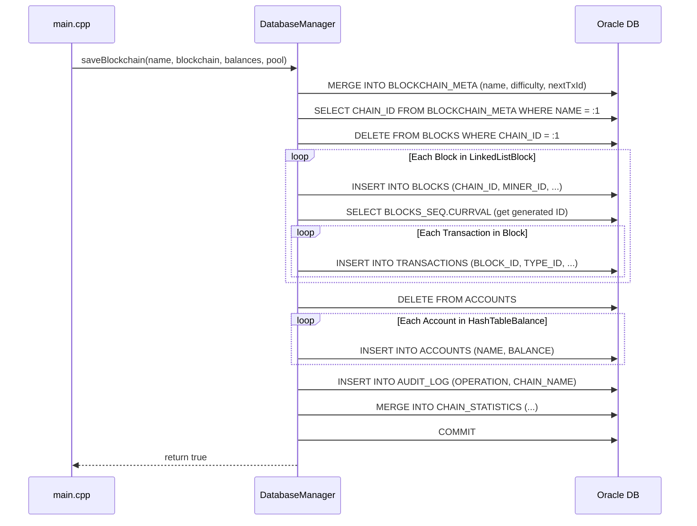
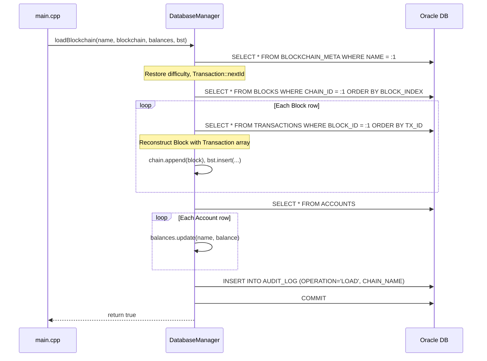
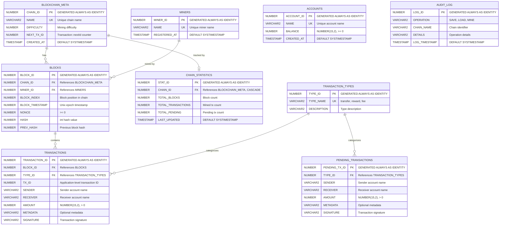

# Design Document: Oracle Database Migration

## Overview

This design migrates the Blockchain Simulator's persistence layer from flat-file (.bc) storage to Oracle Database using the Oracle C++ Call Interface (OCCI). The migration introduces a `DatabaseManager` class that encapsulates all Oracle interactions behind a clean interface, while preserving every existing in-memory data structure (`LinkedListBlock`, `PriorityQueueTransaction`, `BSTTransactionIndex`, `HashTableBalance`, `Block`, `Transaction`) without modification.

The database schema consists of nine UPPERCASE tables across six entities, enforcing referential integrity via foreign keys with `ON DELETE CASCADE`, using `GENERATED ALWAYS AS IDENTITY` for primary keys, and storing currency as `NUMBER(15,2)`. All SQL operations use OCCI prepared statements with positional bind variables — zero string concatenation of data values — to prevent SQL injection.

### Key Design Decisions

1. **Clean-save strategy**: `saveBlockchain()` deletes existing chain data before re-inserting, avoiding complex merge/upsert logic. `ON DELETE CASCADE` ensures child rows are removed automatically.
2. **OCCI Statement reuse**: Prepared statements are created per-operation and terminated after use. The `Environment` and `Connection` are long-lived across the session.
3. **Default entities**: A `SYSTEM` miner and three transaction types (`transfer`, `reward`, `fee`) are seeded at schema creation time and looked up by name during operations.
4. **Commit boundaries**: Each public method (`saveBlockchain`, `loadBlockchain`, etc.) manages its own commit/rollback boundary. `autoCommit` is off; explicit `conn->commit()` is called on success.
5. **Block hash/prevHash as int**: The existing codebase uses `int` for hash values (not hex strings), so the schema stores them as `NUMBER` columns.

## Architecture

```mermaid
graph TD
    subgraph "Existing (Unchanged)"
        MAIN[main.cpp<br/>Menu Loop]
        BC[Blockchain<br/>LinkedListBlock]
        PQ[PriorityQueueTransaction<br/>Max-Heap]
        HT[HashTableBalance<br/>Open-Chain Hash]
        BST[BSTTransactionIndex<br/>Binary Search Tree]
        BLK[Block]
        TX[Transaction]
    end

    subgraph "New Persistence Layer"
        CFG[db_config.h<br/>Connection Constants]
        DMH[db_manager.h<br/>Class Declaration]
        DM[db_manager.cpp<br/>DatabaseManager Implementation]
        SQL[schema.sql<br/>Oracle DDL]
    end

    subgraph "Oracle Database"
        ACCT[ACCOUNTS]
        META[BLOCKCHAIN_META]
        MINERS_T[MINERS]
        TTYPES[TRANSACTION_TYPES]
        BLOCKS_T[BLOCKS]
        TXS[TRANSACTIONS]
        PTX[PENDING_TRANSACTIONS]
        AUDIT[AUDIT_LOG]
        STATS[CHAIN_STATISTICS]
    end

    MAIN -->|"menu options 2,3,4,5"| DM
    DM -->|"reads"| CFG
    DM -->|"traverses"| BC
    DM -->|"reads/writes"| HT
    DM -->|"enqueues"| PQ
    DM -->|"rebuilds"| BST
    DM -->|"OCCI"| ACCT
    DM -->|"OCCI"| META
    DM -->|"OCCI"| BLOCKS_T
    DM -->|"OCCI"| TXS
    DM -->|"OCCI"| PTX
    DM -->|"OCCI"| AUDIT
    DM -->|"OCCI"| STATS
    DM -->|"OCCI"| MINERS_T
    DM -->|"OCCI"| TTYPES
```



### Data Flow: Save Blockchain



### Data Flow: Load Blockchain




## Components and Interfaces

### 1. `schema.sql` — Oracle DDL

Defines all nine tables, sequences (implicit via IDENTITY), constraints, and seed data.

**Table Definitions:**

| Table | Primary Key | Foreign Keys | Key Columns |
|-------|------------|--------------|-------------|
| `ACCOUNTS` | `ACCOUNT_ID` (IDENTITY) | — | `NAME` (UNIQUE), `BALANCE` NUMBER(15,2), `CREATED_AT` TIMESTAMP |
| `BLOCKCHAIN_META` | `CHAIN_ID` (IDENTITY) | — | `NAME` (UNIQUE), `DIFFICULTY` NUMBER, `NEXT_TX_ID` NUMBER, `CREATED_AT` TIMESTAMP |
| `MINERS` | `MINER_ID` (IDENTITY) | — | `NAME` (UNIQUE), `REGISTERED_AT` TIMESTAMP |
| `TRANSACTION_TYPES` | `TYPE_ID` (IDENTITY) | — | `TYPE_NAME` (UNIQUE), `DESCRIPTION` VARCHAR2 |
| `BLOCKS` | `BLOCK_ID` (IDENTITY) | `CHAIN_ID` → BLOCKCHAIN_META, `MINER_ID` → MINERS | `BLOCK_INDEX`, `BLOCK_TIMESTAMP`, `NONCE`, `HASH`, `PREV_HASH` |
| `TRANSACTIONS` | `TRANSACTION_ID` (IDENTITY) | `BLOCK_ID` → BLOCKS, `TYPE_ID` → TRANSACTION_TYPES | `TX_ID`, `SENDER`, `RECEIVER`, `AMOUNT` NUMBER(15,2), `METADATA`, `SIGNATURE` |
| `PENDING_TRANSACTIONS` | `PENDING_TX_ID` (IDENTITY) | `TYPE_ID` → TRANSACTION_TYPES | `SENDER`, `RECEIVER`, `AMOUNT` NUMBER(15,2), `METADATA`, `SIGNATURE` |
| `AUDIT_LOG` | `LOG_ID` (IDENTITY) | — | `OPERATION` VARCHAR2, `CHAIN_NAME` VARCHAR2, `DETAILS` VARCHAR2, `LOG_TIMESTAMP` TIMESTAMP DEFAULT SYSTIMESTAMP |
| `CHAIN_STATISTICS` | `STAT_ID` (IDENTITY) | `CHAIN_ID` → BLOCKCHAIN_META (CASCADE) | `TOTAL_BLOCKS`, `TOTAL_TRANSACTIONS`, `TOTAL_PENDING`, `LAST_UPDATED` TIMESTAMP |

**CHECK Constraints:**
- `CHK_TX_AMOUNT`: `AMOUNT > 0` on TRANSACTIONS
- `CHK_PENDING_AMOUNT`: `AMOUNT > 0` on PENDING_TRANSACTIONS
- `CHK_BLOCK_NONCE`: `NONCE >= 0` on BLOCKS
- `CHK_ACCOUNT_BALANCE`: `BALANCE >= 0` on ACCOUNTS

**Seed Data:**
- TRANSACTION_TYPES: `('transfer', 'Standard transfer')`, `('reward', 'Mining reward')`, `('fee', 'Transaction fee')`
- MINERS: `('SYSTEM', SYSTIMESTAMP)`

### 2. `db_config.h` — Connection Constants

```cpp
#ifndef DB_CONFIG_H
#define DB_CONFIG_H

#include <string>

const std::string DB_USERNAME = "blockchain_user";
const std::string DB_PASSWORD = "blockchain_pass";
const std::string DB_CONNECTION_STRING = "//localhost:1521/XEPDB1";

#endif // DB_CONFIG_H
```

### 3. `db_manager.h` — Class Declaration

```cpp
#ifndef DB_MANAGER_H
#define DB_MANAGER_H

#include <string>
#include <oracle/occi.h>

// Forward declarations (existing classes, unchanged)
class Blockchain;
class HashTableBalance;
class PriorityQueueTransaction;
class BSTTransactionIndex;
class Transaction;

class DatabaseManager {
private:
    oracle::occi::Environment* env;
    oracle::occi::Connection* conn;

    int getChainId(const std::string& chainName);
    int getSystemMinerId();
    int getTransferTypeId();

public:
    DatabaseManager();
    ~DatabaseManager();

    // Connection management
    bool connect();
    void disconnect();

    // Blockchain persistence
    bool saveBlockchain(const std::string& chainName,
                        Blockchain* blockchain,
                        HashTableBalance* balances,
                        PriorityQueueTransaction* pool);
    bool loadBlockchain(const std::string& chainName,
                        Blockchain* blockchain,
                        HashTableBalance* balances,
                        BSTTransactionIndex* bst);

    // Pending transactions
    bool savePendingTransaction(const Transaction& tx);
    bool loadPendingTransactions(PriorityQueueTransaction* pool);
    bool clearPendingTransactions(const std::string& chainName);

    // Account balances
    bool updateBalance(const std::string& accountName, double balance);
    bool initializeDefaultAccounts();
};

#endif // DB_MANAGER_H
```

### 4. `db_manager.cpp` — Implementation

The implementation file includes all OCCI operations. Every public method follows this pattern:

1. Create a `Statement` via `conn->createStatement(sql)`
2. Bind parameters positionally: `stmt->setString(1, value)`, `stmt->setInt(2, value)`, `stmt->setDouble(3, value)`
3. Execute: `stmt->executeUpdate()` for DML, `stmt->executeQuery()` for SELECT
4. Process `ResultSet` if applicable: `rs->next()`, `rs->getString(1)`, etc.
5. Terminate statement: `conn->terminateStatement(stmt)`
6. Wrap in `try/catch (oracle::occi::SQLException& e)` at the method boundary
7. Call `conn->commit()` on success, return `true`/`false`

### 5. `main.cpp` — Menu Integration Changes

Only four menu branches change:

| Menu Option | Current Behavior | New Behavior |
|-------------|-----------------|--------------|
| 2 (Load) | `bc->loadFromFile(filename, balances, bst)` | `dbManager.loadBlockchain(filename, blockchain, balances, bst)` |
| 3 (Save) | `bc->saveToFile(filename, balances)` | `dbManager.saveBlockchain(filename, blockchain, balances, pool)` |
| 4 (Add TX) | `pool->enqueue(tx)` only | `pool->enqueue(tx)` + `dbManager.savePendingTransaction(*tx)` |
| 5 (Mine) | Balance updates in-memory only | Balance updates + `dbManager.clearPendingTransactions(chainName)` + `dbManager.updateBalance()` per account |

A `DatabaseManager` instance is created in `main()` alongside the existing pointers. `dbManager.connect()` is called once at startup; `dbManager.disconnect()` is called before exit.


## Data Models

### Entity-Relationship Diagram



### Type Mappings: C++ ↔ Oracle

| C++ Type | Oracle Column Type | OCCI Bind Method | OCCI Get Method |
|----------|-------------------|------------------|-----------------|
| `int` (hash, prevHash, nonce, index) | `NUMBER` | `setInt()` | `getInt()` |
| `long` (timestamp) | `NUMBER` | `setInt()` (cast) | `getInt()` (cast to long) |
| `double` (amount, balance) | `NUMBER(15,2)` | `setDouble()` | `getDouble()` |
| `string` (sender, receiver, name) | `VARCHAR2(100)` | `setString()` | `getString()` |
| `string` (metadata, details) | `VARCHAR2(500)` | `setString()` | `getString()` |
| `string` (signature) | `VARCHAR2(200)` | `setString()` | `getString()` |
| `int` (Transaction::nextId) | `NUMBER` | `setInt()` | `getInt()` |

### Normalization Analysis

- **1NF**: All columns store atomic values. Transactions are in a separate table, not embedded in blocks.
- **2NF**: Every non-key column depends on the full primary key (all tables use single-column IDENTITY PKs).
- **3NF**: No transitive dependencies. Miner name is in MINERS (not duplicated in BLOCKS). Transaction type name is in TRANSACTION_TYPES (not duplicated in TRANSACTIONS). Chain name is in BLOCKCHAIN_META (not duplicated in BLOCKS).


## Correctness Properties

*A property is a characteristic or behavior that should hold true across all valid executions of a system — essentially, a formal statement about what the system should do. Properties serve as the bridge between human-readable specifications and machine-verifiable correctness guarantees.*

### Property 1: Blockchain Save/Load Round-Trip

*For any* valid blockchain state consisting of a chain name, difficulty level, sequence of blocks (each with index, timestamp, nonce, hash, prevHash, and a list of transactions with id, sender, receiver, amount, metadata, signature), a set of account balances, and a Transaction::nextId counter — saving the state via `saveBlockchain()` and then loading it via `loadBlockchain()` into fresh in-memory structures SHALL produce:
- The same difficulty value
- The same number of blocks in the same order
- Each block with identical index, timestamp, nonce, hash, and prevHash
- Each block's transactions with identical id, sender, receiver, amount, metadata, and signature
- The same account balances for every account
- The same Transaction::nextId value
- A BSTTransactionIndex where every transaction ID resolves to the correct block index and transaction position

**Validates: Requirements 4.1, 4.2, 4.3, 4.4, 4.5, 4.6, 5.1, 5.2, 5.3, 5.4, 5.5, 5.6**

### Property 2: Pending Transaction Save/Load Round-Trip

*For any* set of pending transactions, each with sender, receiver, amount, metadata, and signature — saving each via `savePendingTransaction()` and then loading all via `loadPendingTransactions()` into a fresh `PriorityQueueTransaction` SHALL produce a queue containing exactly the same transactions (same sender, receiver, amount, metadata, signature for each), regardless of the order they were inserted.

**Validates: Requirements 6.1, 6.2**

### Property 3: Account Balance Upsert Idempotence

*For any* account name and non-negative balance value, calling `updateBalance(name, balance)` — whether the account already exists or not — and then querying the ACCOUNTS table for that name SHALL return exactly the provided balance value. Furthermore, calling `updateBalance` twice with the same name but different balances SHALL result in only the latest balance being stored.

**Validates: Requirements 7.1, 7.2**

## Error Handling

### Strategy

All database errors are handled via OCCI's `oracle::occi::SQLException` exception class. The `DatabaseManager` follows a consistent pattern:

1. **Catch at method boundary**: Every public method wraps its body in `try { ... } catch (oracle::occi::SQLException& e) { ... }`.
2. **Extract diagnostics**: The catch block calls `e.getErrorCode()` and `e.getMessage()` to get the Oracle error code and human-readable message.
3. **Report via printError()**: The existing `printError()` utility function (already in main.cpp) is used to display errors with consistent formatting.
4. **Return failure indicator**: Methods return `false` on failure. No exceptions propagate to calling code.
5. **No partial commits**: If an error occurs mid-operation, the transaction is not committed. Oracle's implicit rollback on connection close handles cleanup, but explicit rollback can be added for safety.

### Error Scenarios

| Scenario | Handling |
|----------|----------|
| Invalid connection credentials | `connect()` returns `false`, prints error |
| Network timeout / Oracle unavailable | `connect()` returns `false`, prints error |
| Duplicate chain name on save | MERGE handles upsert — no error |
| Non-existent chain on load | `loadBlockchain()` returns `false`, prints "chain not found" |
| CHECK constraint violation (negative amount) | `saveBlockchain()` returns `false`, prints Oracle error |
| Foreign key violation | Caught by SQLException, returns `false` |
| `disconnect()` called without prior `connect()` | Null-checks on `env` and `conn` — no-op |

### Null Safety

The `DatabaseManager` constructor initializes `env` and `conn` to `nullptr`. All methods check for null connection before proceeding:

```cpp
if (conn == nullptr) {
    printError("Not connected to database");
    return false;
}
```

## Testing Strategy

### Unit Tests (Example-Based)

Unit tests cover specific scenarios, edge cases, and error conditions:

- **Connection management**: Connect with valid credentials succeeds; connect with invalid credentials returns false; disconnect without connect is safe; double-disconnect is safe.
- **Default account initialization**: After `initializeDefaultAccounts()`, verify Alice=1000, Bob=1000, Charlie=1000, David=500, Eve=750 exist in ACCOUNTS.
- **Default miner**: After initialization, SYSTEM miner exists in MINERS.
- **Non-existent chain load**: `loadBlockchain("nonexistent")` returns false.
- **Audit logging**: After save, AUDIT_LOG contains a SAVE row; after load, a LOAD row; after clear pending, a MINE row.
- **Chain statistics**: After save, CHAIN_STATISTICS reflects correct block/transaction counts.
- **Menu integration**: Menu options 2, 3, 4, 5 invoke the correct DatabaseManager methods.

### Integration Tests

Integration tests verify database behavior with a live Oracle instance:

- **Schema validation**: All nine tables exist with correct columns, types, and constraints (query USER_TABLES, USER_TAB_COLUMNS, USER_CONSTRAINTS).
- **CASCADE delete**: Deleting a chain removes its blocks, transactions, and statistics.
- **CHECK constraints**: Negative amounts, negative nonces, and negative balances are rejected.
- **IDENTITY generation**: Primary keys are auto-generated on insert.
- **Seed data**: TRANSACTION_TYPES has 3 rows; MINERS has SYSTEM row.
- **Miner/type association**: Saved blocks reference SYSTEM miner; saved transactions reference transfer type.

### Property-Based Tests

Property-based tests verify universal correctness properties using generated inputs. The testing library is [RapidCheck](https://github.com/emil-e/rapidcheck) for C++.

- **Minimum 100 iterations** per property test
- Each test is tagged with a comment referencing the design property

| Property | Generator Strategy | Verification |
|----------|-------------------|--------------|
| Property 1: Blockchain Round-Trip | Generate random chain name, difficulty (1-5), 1-10 blocks each with 0-5 transactions (random sender/receiver strings, positive amounts, random metadata/signatures), random account balances, random nextId | Save, load into fresh structures, compare all fields |
| Property 2: Pending TX Round-Trip | Generate 1-20 random transactions with random sender/receiver, positive amounts, random metadata/signatures | Save each, load all, verify same set of transactions exists (order may differ due to priority queue) |
| Property 3: Balance Upsert | Generate random account name (alphanumeric, 1-50 chars) and non-negative balance (0 to 999999.99) | Update, query, verify match. Update again with different balance, query, verify latest |

**Tag format**: `// Feature: oracle-db-migration, Property {N}: {title}`

