## Activity Diagram — Create Blockchain

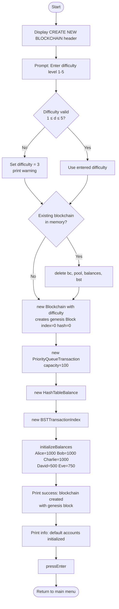

## Activity Diagram — Mine Pending Transactions

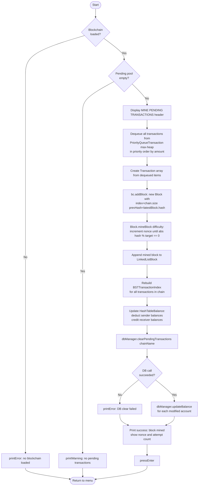

## Activity Diagram — Save Blockchain to Oracle

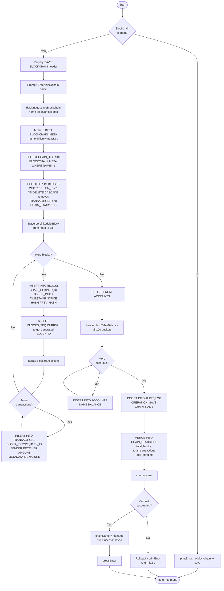

## Component Diagram

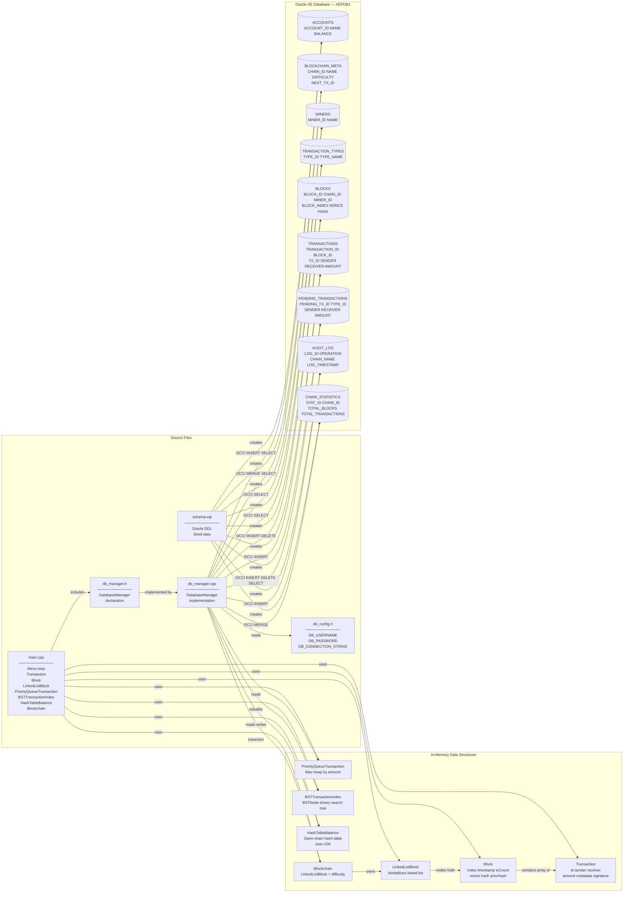

## Deployment Diagram

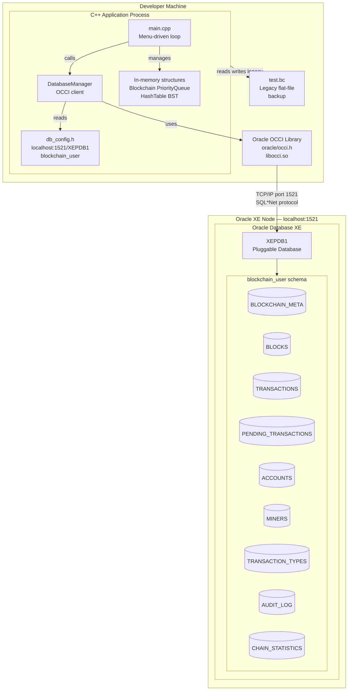

## Sequence Diagram — Save Blockchain

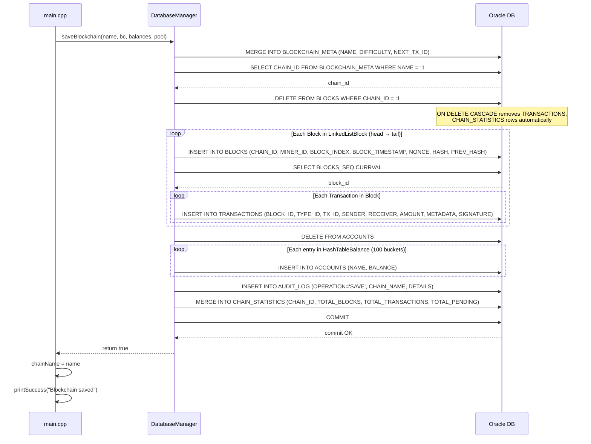

## Sequence Diagram — Load Blockchain

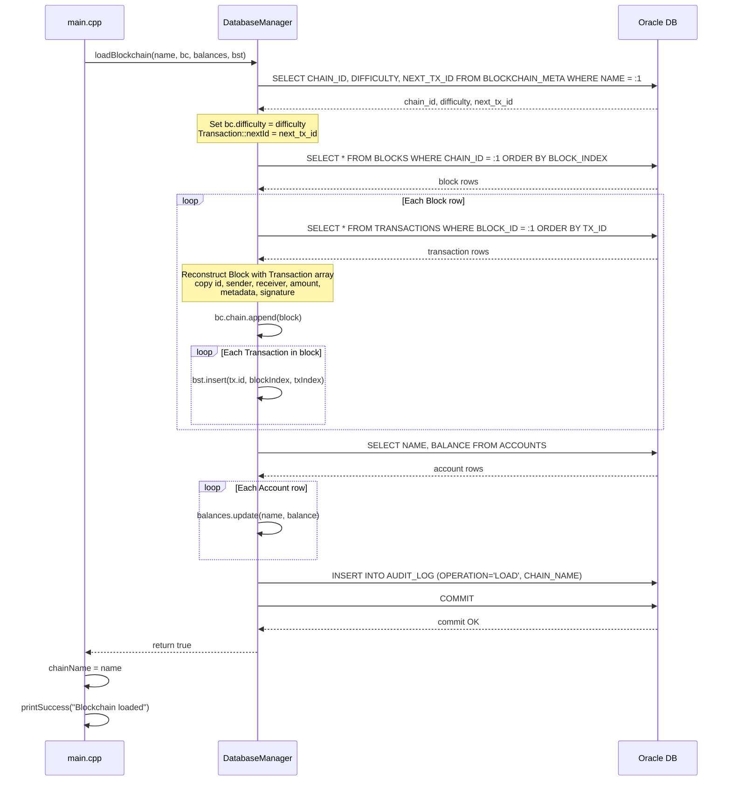

## Use Case Diagram 1 — Blockchain Management

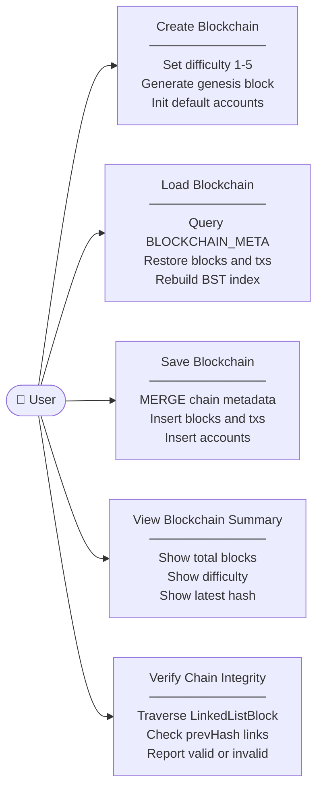

## Use Case Diagram 2 — Transaction Management

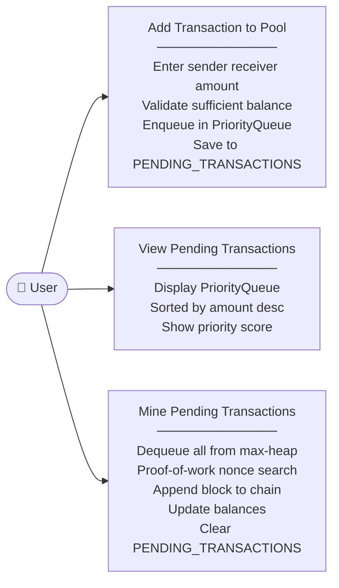

## Use Case Diagram 3 — Account Management

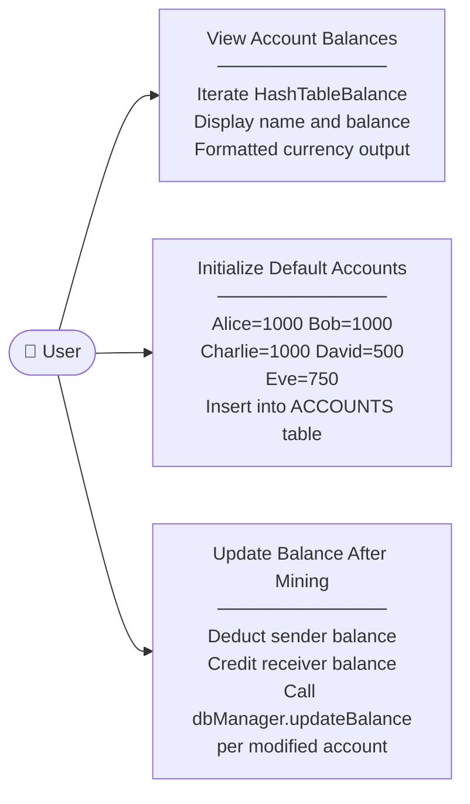

## Use Case Diagram 4 — Search & Query

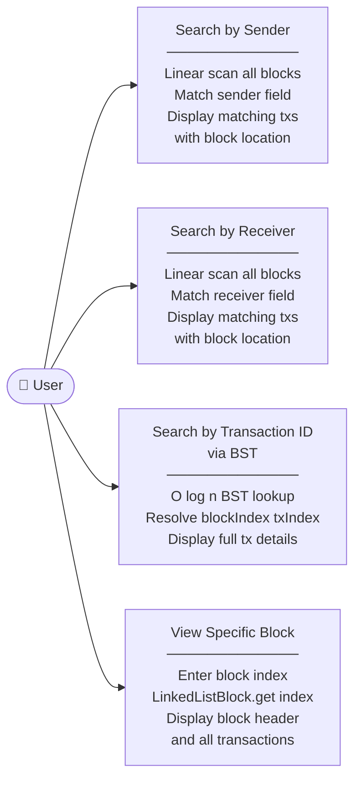

## Use Case Diagram 5 — Database Operations

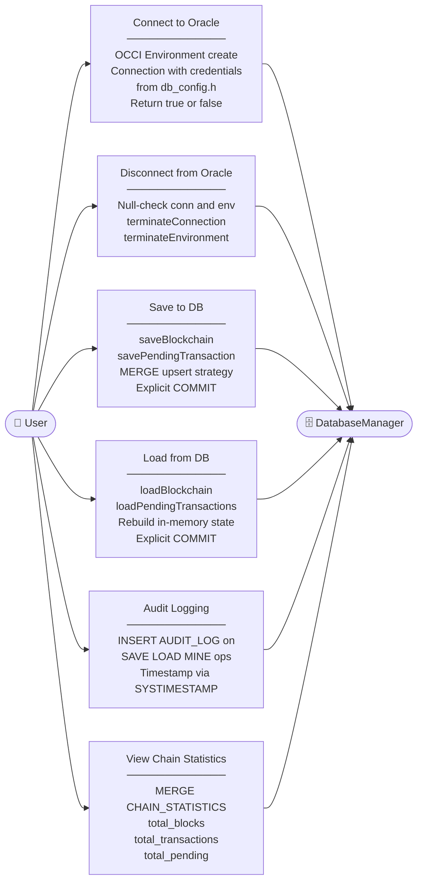

## State Diagram — Blockchain Application Lifecycle

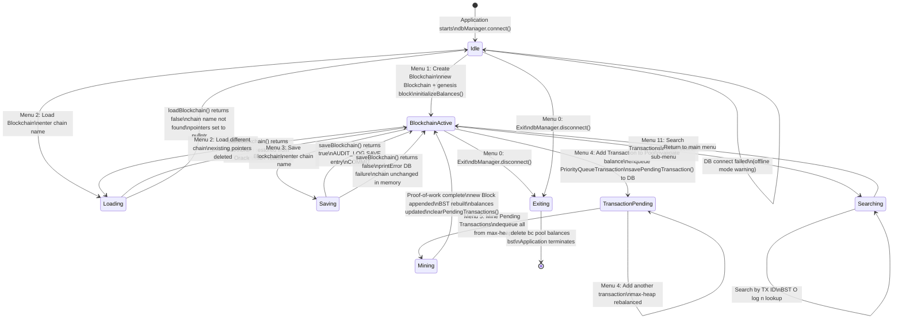
